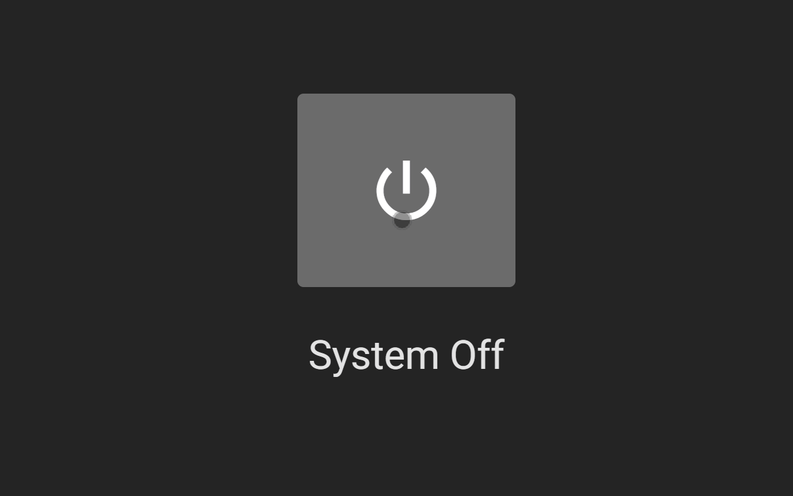
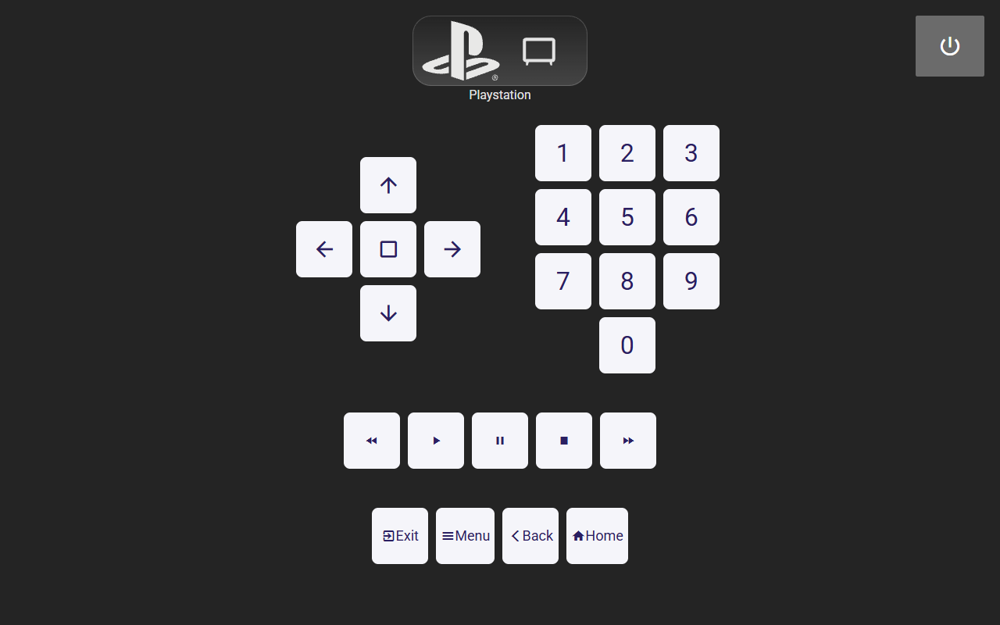
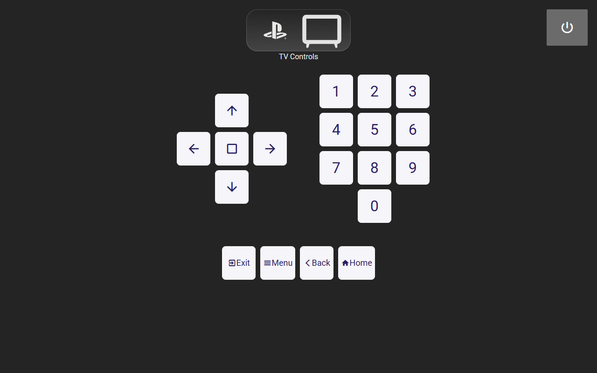

# My Home Loungeroom Control System

[](LICENSE)
[](https://github.com/n1gh7shift/Home-Loungeroom/stargazers)
[](https://github.com/n1gh7shift/Home-Loungeroom/network/members)

This setup controls my loungeroom with a basic CEC-controlled TV, PlayStation 5, Crestron DMPS3-4K-50, and Crestron TSW-1060.

---

## Table of Contents

- [Introduction](#introduction)
- [Features](#features)
- [Prerequisites](#prerequisites)
- [Installation](#installation)
  - [CH5 UI](#ch5-ui)
- [Screenshots](#screenshots)
- [License](#license)

---

## Introduction

My lounge room features a basic CEC-controlled TV and a PlayStation 5™.
I wanted a simple control system to handle automation for all devices.
I used this project to practice and learn CH5 UI development.

For automation, I designed the system so that anything can initiate a power-on sequence.
For example: turning the TV on with its remote, powering on the PlayStation™ with its controller, or touching the UI's Power button. There is a single source of truth for the system's "on" state, but multiple ways to switch it on or off.

This is the first time I've used CEC in any extensive manner. I've implemented custom CEC codes through various paths, either read from existing drivers or manually injected via a Serial I/O.

Thanks to [CEC-O-Matic](https://www.cec-o-matic.com/) for invaluable assistance with CEC Codes. It's an incredible resource.

The shutdown feature waits until both the PlayStation™ and TV have reported "Off" before allowing the system to be switched on again. I intend to add feedback to the screen for warm-up/cool-down periods, but this feature is not yet finished.

## Features

- **Auto Start/Stop:** Multiple "on" and "off" routes with a single source of truth for the system's state.
- **Svelte UI:** Designed specifically for the TSW-1060, featuring smooth transitions.

## Prerequisites

- Crestron SIMPL Windows (version X.X or higher)
- Crestron Toolbox (version X.X or higher)
- Crestron Control System (Mine is a DMPS3-4K-50)
- Crestron Touchscreen (Mine is a TSW-1060)
  - Web Xpanel is not supported on this project due to licensing; however, it could be easily added for 4-Series processors.
- [Crestron Enterprise Development Kit (EDK)](https://sdkcon78221.crestron.com/sdk/Crestron_EDK_SDK/Content/Topics/Home.htm) (For automated script-based deployment)
- Node.js (I used v22.14.0)
- npm (comes with Node.js) or Yarn
- Basic understanding of Crestron SIMPL Windows programming.
- Familiarity with Svelte and web development concepts (HTML, CSS, JavaScript).

## Installation

### CH5 UI

1.  **Navigate to UI Directory:** Open your terminal or command prompt and navigate to the `ch5_ui/` directory:
    ```bash
    cd .\ui\
    ```
2.  **Install Dependencies:** Install the required Node.js packages:
    ```bash
    npm install
    # or
    yarn install
    ```
3.  **Build the UI:** Compile the Svelte application for deployment:
    ```bash
    npm run archive
    ```
    This will generate the CH5 UI files in the `ch5_ui/dist` directory and compile them into `ch5-svelte.ch5z`.
4.  **Upload to Processor:**
    - Scripts are provided in the `package.json` file for deployment.
    - It is recommended to run `ch5-cli deploy -p -t touchscreen -H TouchpanelHostnameOrIP ./ch5-svelte.ch5z -vvv` once. The `-p` flag will prompt for username and password credentials and store them in your environment variables for future use.
    - Subsequent transfers can be performed with `npm run deploy` or `npm run oneclick`.
    - `npm run oneclick` will execute the build, archive, and deploy functions in a single command.
    - If you encounter difficulties, please open an issue on GitHub.

## Screenshots






Simple, but effective and very useful.

## License

MIT - Have it. Modify it. Let me know if you use it and do something interesting with it.
It's great to see more and more Crestron Developers doing so lately. ♥ to the Community.
